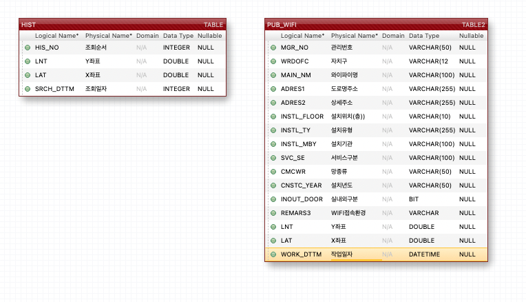

# SEOUL PUBLIC WIFI
22.10.31

Open API, JSP/JAVA 연습, SQL 응용을 위한 프로젝트

프로젝트 목적

Java만을 이용하여 웹에서부터 새로운 데이터베이스까지 사용하여 스킬업을 하고자 함

공공API 호출 및 사용해보기
Json Data Parsing

프로젝트 기능 및 플로우

공공API 정보 가져오기 버튼으로 데이터를 DB에 저장
화면에서 내 위치(위도, 경도)를 입력 후 DB 조회
가장 가까운 공공WIFI 10개를 화면에 출력
조회한 내 위치(위도, 경도), 조회 시간을 히스토리에 저장

### ERD

### 

